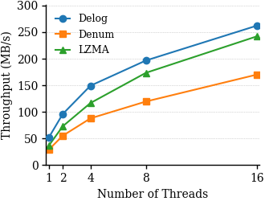

# DeLog: Efficient and Compact Log Compression with Semantic Signature Synthesis
### Artifact for USENIX FAST '27 Spring Cycle Submission

> **A Note on Artifact Viewing:** We have observed that the anonymous artifact hosting platform, `https://anonymous.4open.science/`, has certain limitations in rendering this `README.md` file. Specifically, you may find that:
> *   The internal links in the Table of Contents are not clickable.
> *   The code blocks lack a convenient one-click "copy" button, requiring manual selection.

> We sincerely apologize for any inconvenience this may cause during your evaluation. The full, interactive experience will be available on the public GitHub repository once the anonymous review process is complete.
We sincerely thank the Artifact Evaluation Committee for dedicating their time and expertise to reviewing our work. This artifact provides all the necessary components, data, and instructions to reproduce the key findings presented in our paper. We have strived to make the evaluation process as clear and straightforward as possible and welcome any feedback for improvement.
---

### Table of Contents
1.  [Artifact Overview](#1-artifact-overview)
2.  [Getting Started](#2-getting-started)
    *   [2.1. Hardware Requirements](#21-hardware-requirements)
    *   [2.2. Setup Options](#22-setup-options)
        *   [Option A: Manual Setup (for deep-dive and ablation studies)](#option-a-manual-setup-for-deep-dive-and-ablation-studies)
        *   [Option B: Using Docker (Recommended for quick evaluation)](#option-b-using-docker-recommended-for-quick-evaluation)
3.  [Reproducing Key Evaluation Results](#3-reproducing-key-evaluation-results)
    *   [3.1. Main Evaluation: DeLog Performance (RQ3)](#31-main-evaluation-delog-performance-rq3)
    *   [3.2. Baseline Comparisons (RQ3)](#32-baseline-comparisons-rq3)
    *   [3.3. Ablation Study (RQ5)](#33-ablation-study-rq5)
4.  [Reproducing Specific Claims](#4-reproducing-specific-claims)
    *   [4.1. Claim from Section 2.1: Average Character Length](#41-claim-from-section-21-average-character-length)
    *   [4.2. Claim from Section 2.3: Lossiness in Existing Compressors](#42-claim-from-section-23-lossiness-in-existing-compressors)
    *   [4.3. Claim from Section 2.3: Resource Utilization Overhead](#43-claim-from-section-23-resource-utilization-overhead)
5.  [Reproducing Supplementary Material](#5-supplementary-material-empirical-study-on-log-parsers)
     *   [5.1. The Performance of General-Purpose Compressors on All Logs](#51-the-performance-of-general-compressor-on-all-logs)
     *   [5.2. Run Log Parsers](#52-running-log-parsers)
     *   [5.3. Compression on Parsing Results](#53-compression-based-on-parsing-results)
6.  [Additional Results](#6-additonal-results)
    *   [6.1. Parsing Accuracy of DeLog](#61-parsing-accuracy-of-delog)
    *   [6.2. System-level Evaluation](#62-system-level-evaluation)
    *   [6.3. The Compression Ratio of µSlope(CLP)](#63-the-compression-ratio-of-µslopeclp)
    *   [6.4. How to Reproduce these New Results](#64-how-to-reproduce-these-new-results)
---

## 1. Artifact Overview

This artifact accompanies the paper "DeLog: An Efficient Log Compression Framework with Pattern-based Grouping". It enables the reproduction of the following key results:

*   **RQ3 & RQ4:** The performance of DeLog on all public benchmark datasets (Loghub and Loghub 2.0).
*   **RQ3 & RQ4:** The performance of baseline methods (LogReducer, Denum, LogShrink) on the same public benchmarks.
*   **RQ5:** The effectiveness of each component of DeLog through a detailed ablation study.
*   **Specific Claims:** Verification of claims made in the paper regarding log characteristics, baseline lossiness, and resource utilization.
*   **Supplementary Study:** An empirical study on the accuracy of existing log parsers and its impact on compression.

> **Note on Private Datasets:** The ByteDance dataset is private due to user privacy and data confidentiality agreements and is **not included** in this artifact. We are fully committed to transparency and have designed the artifact to allow for the complete reproduction of all experiments, figures, tables, and conclusions based on the publicly available **Loghub** and **Loghub 2.0** benchmarks.

## 2. Getting Started

This section outlines the necessary prerequisites and initial setup steps.

### 2.1. Hardware Requirements

- **CPU**: A modern CPU with at least **4 cores** is required. (Recommended: Intel i5, AMD Ryzen 5, or better). DeLog is designed for parallel execution and benefits significantly from multiple cores.
- **Memory (RAM)**:
    - **For DeLog only**: Minimum **4 GB**, Recommended **8 GB**.
    - **For All Baselines**: To reproduce all experiments, a system with **32 GB of RAM** is strongly recommended, as some baselines (e.g., LogReducer) have very high memory consumption.

### 2.2. Setup Options

We offer two methods to set up the environment. For a quick verification of our main results, we highly recommend the Docker-based approach. For detailed ablation studies or modifications to the source code, the manual setup is more suitable.

#### Option A: Manual Setup (for deep-dive and ablation studies)

This traditional approach requires you to manually install dependencies and compile the source code.

**1. Software Dependencies:**
- **Python**: `>= 3.7.3`
- **GCC**: `>= 9.4.0`
- **PCRE2**: `= 10.34`
- **Python Package**: `regex==2012.1.8`

**2. Dataset Preparation:**
- **Loghub (1.0):** Download from [https://github.com/logpai/loghub](https://github.com/logpai/loghub) and place the datasets in `Logs/{logname}/{logname}.log` (e.g., `Logs/Apache/Apache.log`).
- **Loghub 2.0:** Download from [https://zenodo.org/records/8275861](https://zenodo.org/records/8275861) and place the datasets in `Loghub_data/{logname}/{logname}.log`.
> **Note:** The `Apache` log is already included in the `Logs/` directory for a quick test run.

**3. Compilation:**
Compile the DeLog compressor and decompressor.
```bash
# Compile Compressor
g++ -std=c++17 -O3 -o Delog_compress compressor.cpp -lpcre2-8 -lstdc++fs -pthread -larchive

# Compile Decompressor
g++ -std=c++17 -O2 -o decompress decompressor.cpp -lstdc++fs -pthread -larchive
```

---

#### Option B: Using Docker (Recommended for quick evaluation)

This method uses pre-configured Docker images that contain all dependencies and executables. It is the fastest way to run and verify our complete compression/decompression workflow.

**1. Prerequisites:**
- [Docker](https://www.docker.com/products/docker-desktop/) must be installed and running on your system.

**2. Pull the Docker Images:**
Open your terminal and pull the pre-built images for both the compressor and decompressor from Docker Hub.
```sh
# 

# Pull the compressor image
docker pull anonymous4d3a/delog-compressor:latest

# Pull the decompressor image
docker pull anonymous4d3a/delog-decompressor:latest
```

**3. Prepare Datasets:**
You need to provide the log files from your local machine.
- Create three directories on your system:
  - `my_logs`: for input log files.
  - `compressed_archives`: for the output of the compression step.
  - `decompressed_logs`: for the final decompressed output.
- Download a log dataset (e.g., `Apache.log`) and place it inside the `my_logs` folder.

**4. Run DeLog Compression via Docker:**
Navigate to the directory containing the three folders, then execute the command below.
```sh
# On Linux or macOS:
docker run --rm \
-v "$(pwd)/my_logs:/data" \
-v "$(pwd)/compressed_archives:/output" \
anonymous4d3a/delog-compressor \
Apache.log Apache --kernel lzma --threads 4

# On Windows PowerShell:
docker run --rm `
-v "$(pwd)/my_logs:/data" `
-v "$(pwd)/compressed_archives:/output" `
Apache/delog-compressor `
Apache.log Apache --kernel lzma --threads 4
```
After this step, a new directory (e.g., `output_Apache`) containing compressed chunk files will appear inside your `compressed_archives` folder.

**5. Docker Compressor Command-Line Options:**
- **Usage:** `docker run ... anonymous4d3a/delog-compressor [OPTIONS] <input_file> <log_name>`
- **Arguments:**
    - `<input_file>`: The name of the log file inside your `my_logs` folder.
    - `<log_name>`: A logical name for the log type (e.g., `HDFS`, `Apache`). This option enables predefined regular expressions for known benchmark log types to accurately extract timestamps and other common patterns. If you are compressing logs from outside the benchmarks, you can provide any arbitrary string for this parameter. DeLog will still achieve effective performance. Please note that for the compression of all ByteDance logs, we did not use any predefined regular expressions.
- **Options:**
    - `--kernel <name>`: `lzma`, `gzip`, `bzip2`, `none`.
    - `--processing-mode <mode>`: `normal` (DeLog), `fast` (DeLog-L).
    - `--threads <num>`: Number of parallel threads.

**6. Decompress the Archive via Docker:**
Now, use the decompressor image to restore the original log file.
```sh
# On Linux or macOS:
docker run --rm \
-v "$(pwd)/compressed_archives:/input" \
-v "$(pwd)/decompressed_logs:/output" \
anonymous4d3a/delog-decompressor \
output_Apache decompressed_Apache.log 8

# On Windows PowerShell:
docker run --rm `
-v "$(pwd)/compressed_archives:/input" `
-v "$(pwd)/decompressed_logs:/output" `
anonymous4d3a/delog-decompressor `
output_Apache decompressed_Apache.log 8
```
After this command finishes, the fully reconstructed log file `decompressed_Apache.log` will appear in your `decompressed_logs` folder. You can verify that it is identical to the original `my_logs/Apache.log`.

> **Note:** The automated benchmark scripts (`DeLog_benchmark.py`, etc.) and ablation studies are designed to be run in a manual setup environment (Option A), as they involve file system interactions and code modifications not easily managed within the streamlined Docker workflow.


## 3. Reproducing Key Evaluation Results

This section provides step-by-step instructions to reproduce the main experimental results from our paper. **These instructions assume you have chosen `Option A: Manual Setup`.**

### 3.1. Main Evaluation: DeLog Performance (RQ3)

This script automates the process of running DeLog on all specified datasets and collecting performance metrics.

1.  **Configure Datasets:**
    Open the benchmark script `DeLog_benchmark.py` and add the names of the downloaded datasets you wish to evaluate.
    ```python
    # In DeLog_benchmark.py
    DATASET_THRESHOLDS = {
        'HealthApp': 0,
        'HDFS': 0,
        'Apache': 0,
        'OpenSSH': 0,
        # Add other dataset names from Loghub here
    }
    ```

2.  **Run Benchmark:**
    Execute the Python script. It will run both compression and decompression for DeLog (`normal` mode) and DeLog-L (`fast` mode).
    ```bash
    python3 DeLog_benchmark.py
    ```

3.  **Collect Results:**
    The results will be saved in the root directory in the following CSV files:
    *   `experiments_results.csv`: Compression results for DeLog.
    *   `decompression_results.csv`: Decompression results for DeLog.
    *   `experiments_results_fast.csv`: Compression results for DeLog-L.
    *   `decompression_results_fast.csv`: Decompression results for DeLog-L.

### 3.2. Baseline Comparisons (RQ3)

We provide automated benchmark scripts for all baseline methods.

#### LogShrink
1.  Navigate to the directory: `cd Baselines/LogShrink`
2.  Configure datasets in `LogShrink_benchmark.py`:
    ```python
    datasets_to_run = [ 'HealthApp', 'HDFS', 'Apache' ] # Add desired datasets
    ```
3.  Run the benchmark: `python3 LogShrink_benchmark.py`
4.  Results are saved as JSON files in `Baselines/LogShrink/final_result_logshrink/`.

#### LogReducer
1.  Navigate to the directory: `cd Baselines/LogReducer`
2.  Compile the tool: `make`
3.  Run the benchmark: `python3 benchmark_logreducer.py`
4.  Results are saved as JSON files in `Baselines/LogReducer/final_results/`.

#### Denum
1.  Navigate to the directory: `cd Baselines/Denum`
2.  Run the benchmark: `./benchmark.sh`
3.  Results are saved in `Baselines/Denum/compression_results.csv` and `Baselines/Denum/decompression_results.csv`.

### 3.3. Ablation Study (RQ5)

To reproduce the ablation study, you must manually modify the `compressor.cpp` source file, recompile, and re-run the benchmark for each setting.

**Important:** Remember to revert the changes before proceeding to the next setting.

#### Setting 1: No External Context & No Intrinsic Structure
This setting simplifies all variable tokens to a generic `<*>` tag.

1.  **Modify `compressor.cpp`:**
    In `compressor.cpp`, locate the following block:
    ```cpp
    if (is_variable) {
        std::string compact_id = tag_manager.get_or_create_id(full_tag);
        result_line.append("<").append(compact_id).append(">");
        local_tag_data[full_tag].push_back(std::move(value_to_store));
    }
    ```
    And change it to:
    ```cpp
    if (is_variable) {
        full_tag="<*>"; // Force all variable tags to be generic
        std::string compact_id = tag_manager.get_or_create_id(full_tag);
        result_line.append("<").append(compact_id).append(">");
        local_tag_data[full_tag].push_back(std::move(value_to_store));
    }
    ```
2.  **Recompile and Run:**
    ```bash
    g++ -std=c++17 -O3 -o Delog_compress compressor.cpp -lpcre2-8 -lstdc++fs -pthread -larchive
    python3 DeLog_benchmark.py
    ```

#### Setting 2: No External Context
This setting removes the contextual information (preceding token) from the tag generation.

1.  **Modify `compressor.cpp`:**
    Locate the following block:
    ```cpp
    if (type.is_pure_digit || (type.has_digit && !type.has_alpha) || (type.has_digit && type.has_alpha) || type.has_special) {
        is_variable = true;
        if (type.is_pure_digit) {
            if (token.length() <= 2) {
                full_tag = build_structured_tag("", "", std::nullopt, token.length());
            } else {
                full_tag = build_structured_tag(context, generate_regex_like_tag(token), token_index, std::nullopt);
            }
        } else if (type.has_digit && !type.has_alpha) {
            full_tag = build_structured_tag(context, generate_regex_like_tag(token), std::nullopt, std::nullopt);
        } else {
            std::string special_chars_str = extract_special_chars(token);
            full_tag = build_structured_tag(context, "_" + special_chars_str, std::nullopt, std::nullopt);
        }
    ```
    And change all `build_structured_tag(context, ...)` calls to `build_structured_tag("", ...)` to remove the context:
    ```cpp
    if (type.is_pure_digit || (type.has_digit && !type.has_alpha) || (type.has_digit && type.has_alpha) || type.has_special) {
        is_variable = true;
        if (type.is_pure_digit) {
            if (token.length() <= 2) {
                full_tag = build_structured_tag("", "", std::nullopt, token.length());
            } else {
                // Change 'context' to ""
                full_tag = build_structured_tag("", generate_regex_like_tag(token), token_index, std::nullopt);
            }
        } else if (type.has_digit && !type.has_alpha) {
            // Change 'context' to ""
            full_tag = build_structured_tag("", generate_regex_like_tag(token), std::nullopt, std::nullopt);
        } else {
            std::string special_chars_str = extract_special_chars(token);
            // Change 'context' to ""
            full_tag = build_structured_tag("", "_" + special_chars_str, std::nullopt, std::nullopt);
        }
    ```
2.  **Recompile and Run:**
    ```bash
    g++ -std=c++17 -O3 -o Delog_compress compressor.cpp -lpcre2-8 -lstdc++fs -pthread
    python3 DeLog_benchmark.py
    ```

#### Setting 3: Complete DeLog
This is the default configuration. No modifications are needed if you have reverted any previous changes.

## 4. Reproducing Specific Claims

This section details how to verify individual claims made in the paper.

### 4.1. Claim from Section 2.1: Average Character Length

Run the provided Python script to calculate the average length of log lines for a given dataset.

```bash
# Example for a hypothetical dataset
python3 avg_length.py Logs/bytedance_I/bytedance_I.log
```

### 4.2. Claim from Section 2.3: Lossiness in Existing Compressors

This procedure checks for data loss (e.g., dropped leading zeros) in other log compressors.

1.  **Compress and Decompress:** Use a baseline tool (e.g., LogReducer) to compress a log file (like `Apache.log`) and then decompress the resulting archive.
2.  **Compare Files:** Use our `diff_compare.py` script to compare the original log file with the decompressed version. The script is designed to intelligently handle minor, acceptable differences while flagging significant ones.

    ```bash
    # {logname} is the source log name under directory Logs, {differences} is the number of differences will be printed
    python3 diff_compare.py {logname} -m {differences}
    ```

### 4.3. Claim from Section 2.3: Resource Utilization Overhead

We provide scripts to measure peak memory and CPU usage for DeLog and the baselines. These scripts use the `/usr/bin/time -v` command for detailed profiling.

#### For DeLog
```bash
chmod +x performance_benchmark.sh
./performance_benchmark.sh
```
Results are saved to `benchmark_results`. The key metric is **Maximum resident set size (kbytes)**.

#### For Baselines (e.g., LogReducer)
```bash
cd Baselines/LogReducer
chmod +x performance_benchmark.sh
./performance_benchmark.sh
```
Results are saved in `Baselines/LogReducer/benchmark_results`. Similar steps can be followed for other baselines in their respective directories.


#### Table 1: Resource Utilization for Compressing 1GB "bytedance_C" (logC) and "bytedance_D" (logD) of Data.

| Dataset | Tool | Time (s) | CPU Usage (%) | Peak Memory (GB) |
| :--- | :--- | ---: | ---: | ---: |
| LogC (1GB) | DeLog | 18.75 | 269% | 0.74 |
| LogC (1GB) | Denum | 28.94 | 293% | 1.13 |
| LogC (1GB) | LogReducer | 30.82 | 113% | 14.32 |
| LogC (1GB) | LZMA | 32.41 | 313% | 0.55 |
| **LogD (1GB)** | **DeLog** | **32.12** | **266%** | **1.31** |
| LogD (1GB) | Denum | 53.58 | 303% | 1.88 |
| LogD (1GB) | LogReducer | 44.46 | 120% | 22.32 |
| LogD (1GB) | LZMA | 45.21 | 311% | 0.60 |


---
### Additional Note: Manual Execution
For manual compression and decompression of DeLog, please refer to the following commands.

#### Compression
```bash
# Usage: ./Delog_compress {logname} {filetype} {chunksize} {threads} {threshold} {kernel} {mode}
# kernel: lzma, gzip, bzip2
# mode:   normal (DeLog), fast (DeLog-L)
# filetype: text (use this for all benchmarks), json (for debugging)
# threshold: 0 (use this for all benchmarks)
# Example for HDFS log
./Delog_compress HDFS text 100000 4 0 lzma normal
```

#### Decompression
```bash
# Usage: ./decompress {input_path} {output_file} {threads}

# Example for Zookeeper output
./decompress output/Zookeeper decompressed_Zookeeper.log 4
```
> **Important Decompression Note:** The current decompressor is specifically tailored for certain variable types like IP addresses found in the Apache logs. When applying DeLog to new datasets with different structured variables (e.g., MAC addresses, UUIDs), a custom recovery function may need to be implemented, similar to the logic around line 809 in `decompressor.cpp`, to ensure lossless reconstruction.

## 5. Reproducing Supplementary Material: Empirical Study on Log Parsers

This section reproduces the experiment from our supplementary material, which investigates discrepancies in log parser accuracy reported by existing benchmarks.

### 5.1. The Performance of General Compressor on All Logs
1.  **gzip, lzma, bzip2:**
    ```bash
    python general_compressor_benchmark.py
    ```
    Results are saved to `general_chunked_results.csv`


### 5.2. Running Log Parsers

1.  Navigate to the parser's directory:
    ```bash
    cd Log_Parsers/{log_parser_name}
    ```
2.  **Configuration:** Before running, you may need to edit the `benchmark.py` script within each parser's directory to set the correct log file paths and names.
3.  **Run Parsing:**
    ```bash
    python benchmark.py
    ```
    Repeat this for each log parser you wish to evaluate.

### 5.3. Compression Based on Parsing Results

After generating the parsed templates from the previous step, run the following script from the repository's root directory to perform compression based on these templates.

```bash
python run_all.py
```

This script will use the outputs from the log parsers to evaluate a parse-then-compress pipeline, generating the results shown in the supplementary material.


## 6. Addtional Results
### 6.1 Parsing Accuracy of Delog

To get "Parsing Accuracy" of Delog, we conducted an experiment to retroactively derive a "parsing accuracy" metric for DeLog. To do this, we forcibly mapped DeLog's tag generation process to a conventional parsing task. Specifically, we treated tokens tagged as "No pattern" as the template, and all other token types were treated as variables.

Across the 16 public benchmark datasets, DeLog achieved an average PA, PTA, FTA, and RTA of 0. Its average GA was 0.526. For comparison, Drain, a parser widely used in log compressors such as Logzip, achieves an average GA of 0.865 on the same datasets.


| Dataset       |   GA    |   PA    |   PTA   |   RTA   |   FTA   | Tool Templates | Ground Templates |
|:--------------|:-------:|:-------:|:-------:|:-------:|:-------:|:--------------:|:----------------:|
| Android       | 0.456   | 0.000   | 0.000   | 0.000   | 0.000   | 259            | 166              |
| Apache        | 0.000   | 0.000   | 0.000   | 0.000   | 0.000   | 12             | 6                |
| BGL           | 0.744   | 0.000   | 0.000   | 0.000   | 0.000   | 373            | 120              |
| HDFS          | 0.808   | 0.000   | 0.000   | 0.000   | 0.000   | 22             | 14               |
| HPC           | 0.792   | 0.000   | 0.000   | 0.000   | 0.000   | 67             | 46               |
| Hadoop        | 0.716   | 0.000   | 0.000   | 0.000   | 0.000   | 131            | 114              |
| HealthApp     | 1.000   | 0.000   | 0.000   | 0.000   | 0.000   | 75             | 75               |
| Linux         | 0.093   | 0.000   | 0.000   | 0.000   | 0.000   | 202            | 118              |
| Mac           | 0.174   | 0.000   | 0.000   | 0.000   | 0.000   | 621            | 341              |
| OpenSSH       | 0.336   | 0.000   | 0.000   | 0.000   | 0.000   | 197            | 27               |
| OpenStack     | 0.199   | 0.000   | 0.000   | 0.000   | 0.000   | 1500           | 43               |
| Proxifier     | 0.000   | 0.000   | 0.000   | 0.000   | 0.000   | 526            | 8                |
| Spark         | 0.925   | 0.000   | 0.000   | 0.000   | 0.000   | 39             | 36               |
| Thunderbird   | 0.615   | 0.000   | 0.000   | 0.000   | 0.000   | 244            | 149              |
| Windows       | 0.703   | 0.000   | 0.000   | 0.000   | 0.000   | 81             | 50               |
| Zookeeper     | 0.853   | 0.000   | 0.000   | 0.000   | 0.000   | 191            | 50               |
| **Average**   | **0.526** | **0.000** | **0.000** | **0.000** | **0.000** | **283.8**      | **85.2**         |


### 6.2 System-level Evaluation

CPU usage and peak memory are available in Section [4.3. Claim from Section 2.3: Resource Utilization Overhead](#43-claim-from-section-23-resource-utilization-overhead). This section provides I/O and Scalability.

**Setting:** Compress 1GB production logs (LogC) while varying the number of threads (1, 2, 4, 8, 16). We select the fastest log compressor Denum and lzma for comparison. 

**A more comprehensive system-level evaluation will be added to next version of our paper.**


**Throughput vs. Thread Count (I/O):**
<div align="center">
  
</div>


**Scalability:**

We select the fastest log compressor Denum and lzma for comparison. Thread numbers are set to 1,2,4,8,16, Delog consistently achieves the lowest absolute execution time at every thread count. For example, at 16 threads, Delog is 1.54x faster than the fastest log compressor Denum (17.58s vs 27.09s) and 1.08x faster than LZMA (17.58s vs 19.04s). Delog exhibits a similar scaling trend as the others.

| **Threads** | **Delog Time (s)** | **Delog Speedup** | **Denum Time (s)** | **Denum Speedup** | **LZMA Time (s)** | **LZMA Speedup** |
|:---:|:---:|:---:|:---:|:---:|:---:|:---:|
| **1** | 88.41 | 1.00x | 157.57 | 1.00x | 125.38 | 1.00x |
| **2** | 47.97 | 1.84x | 83.47 | 1.89x | 63.14 | 1.99x |
| **4** | 30.87 | 2.86x | 52.44 | 3.01x | 39.48 | 3.18x |
| **8** | 23.43 | 3.77x | 38.55 | 4.09x | 26.56 | 4.72x |
| **16**| 17.58 | 5.03x | 27.09 | 5.82x | 19.04 | 6.59x |

### 6.3 The Compression Ratio of µSlope(CLP)

**Setting:** We evaluated the compression ratio on the 16 public benchmark datasets, comparing DeLog with LZMA, CLP, and a combined CLP+LZMA approach.

| Dataset | LZMA | CLP | CLP+LZMA | Delog |
|:---|---:|---:|---:|---:|
| **Android** | 19.400 | 20.370 | 21.180 | 30.350 |
| **Apache** | 30.750 | 13.560 | 18.620 | 59.650 |
| **BGL** | 22.050 | 11.070 | 12.360 | 45.680 |
| **Hadoop** | 37.600 | 26.810 | 41.260 | 79.630 |
| **HDFS** | 15.620 | 16.410 | 16.640 | 29.010 |
| **HealthApp** | 15.830 | 12.350 | 12.990 | 55.930 |
| **HPC** | 19.790 | 15.100 | 17.750 | 46.840 |
| **Linux** | 19.980 | 9.180 | 13.810 | 30.630 |
| **Mac** | 23.880 | 12.880 | 13.860 | 43.690 |
| **OpenSSH** | 22.270 | 17.920 | 18.760 | 106.010 |
| **OpenStack** | 15.650 | 12.880 | 13.450 | 23.750 |
| **Proxifier** | 21.090 | 9.190 | 12.610 | 30.780 |
| **Spark** | 23.130 | 20.970 | 21.640 | 61.790 |
| **Thunderbird**| 28.540 | 18.980 | 19.560 | 68.650 |
| **Windows** | 217.850 | 446.120 | 469.550 | 541.570 |
| **Zookeeper** | 30.020 | 31.820 | 47.940 | 154.930 |
| **Average** | **35.216** | **44.101** | **48.874** | **88.056** |

### 6.4 How to Reproduce These Results

**1. For parsing accuracy of Delog**

```bash
cd LogParsing

mkdir logs
```
Download the 16 benchmark datasets from [loghub1.0](https://github.com/logpai/loghub) and place them into directory `logs`. The expected directory structure is as follows:

<pre>
logs/
├── Android/
│   ├── Android_2k.log
│   ├── Android_2k.log_structured.csv
│   └── Android_2k.log_templates.csv

├── Apache/
│   ├── Apache_2k.log
│   ├── Apache_2k.log_structured.csv
│   └── Apache_2k.log_templates.csv

├── ...

└── Zookeeper/
    ├── Zookeeper_2k.log
    ├── Zookeeper_2k.log_structured.csv
    └── Zookeeper_2k.log_templates.csv
</pre>


Then, run the evaluation script:
```bash
python3 main_evaluator.py
```
Results will be printed to the console.

**2. For system-level evaluation of baslines**

A script for system-level evaluation is provided in each tool's directory.

**To evaluate DeLog:**
```bash
# Ensure you are in the DeLog project's root directory
chmod +x system-level.sh
./system-level.sh
```
The results will be saved in the `evaluation_results` directory.

**To evaluate Denum:**
```bash
cd Baselines/Denum
chmod +x system-level.sh
./system-level.sh
```
The results will be saved in the `evaluation_results` directory.

**To evaluate LZMA:**
```bash
# Back to DeLog project's root directory
chmod +x system-level_lzma.sh
./system-level_lzma.sh
```
The results will be saved in the `evaluation_results_lzma` directory.
